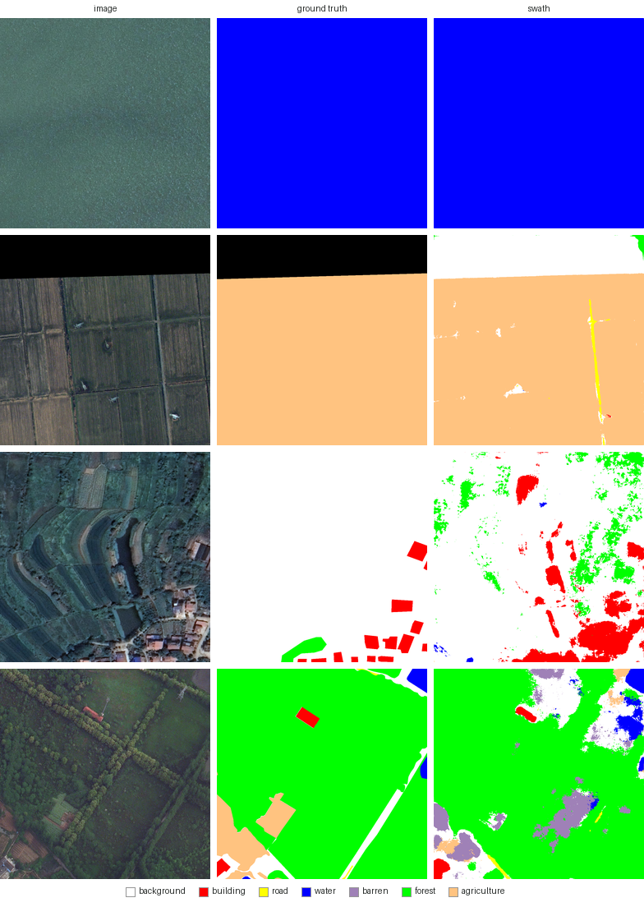
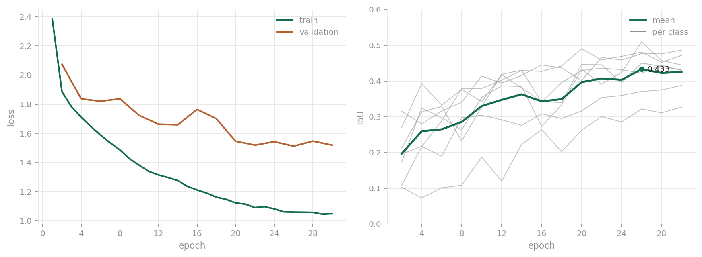

[English](README.md) · **Русский**

# swath

[](https://github.com/DenisDrobyshev/swath/actions/workflows/ci.yml)
[](https://www.python.org/)
[](LICENSE)

Семантическая сегментация аэро- и космоснимков — от сырого датасета до
веб-страницы, на которую можно бросить GeoTIFF и получить маску, всё ещё
знающую своё место на Земле.

*Swath* — полоса захвата, участок поверхности, который снимает сенсор при
пролёте. Пакет занимается тем, что происходит с этой полосой дальше: нарезкой на
тайлы, обучением модели, прогоном её по растрам, которые не помещаются в память
видеокарты, и выдачей результата в виде, который открывается в ГИС.

```
swath prepare loveda --raw data/raw --out data/loveda
swath train --data data/loveda --output runs/landcover
swath evaluate --checkpoint runs/landcover/best.pt --data data/loveda
swath serve --checkpoint runs/landcover/best.pt
```

---

## Что внутри

| | |
|---|---|
| **Модель** | Residual U-Net в одном читаемом файле на чистом PyTorch. Без предобученного энкодера, без библиотек сегментации, с любым числом входных каналов. |
| **Обучение** | AdamW, косинусное расписание с прогревом, смешанная точность, взвешенная кросс-энтропия плюс soft Dice, матрица ошибок по всей валидационной выборке, отбор лучшего чекпоинта по mean IoU и продолжение прогона. |
| **Инференс** | Скользящее окно с блендингом по приподнятому косинусу — границы тайлов не отпечатываются на результате. Опциональная TTA, карта уверенности и просеивание крапчатости. |
| **Геопривязка** | GeoTIFF на входе — GeoTIFF на выходе, та же система координат, тот же трансформ, плюс полигоны в WGS84 и покрытие классов в квадратных метрах. |
| **Сервис** | Приложение на FastAPI с одностраничным интерфейсом: перетащили снимок — получили наложение, карту уверенности, легенду с покрытием и ссылки на скачивание маски, GeoTIFF и GeoJSON. |
| **Чекпоинты** | Самоописывающиеся. Веса, аргументы архитектуры, имена классов и палитра лежат вместе, поэтому для загрузки не нужно ничего, кроме самого файла. |

## Почему сделано именно так

**У модели нет предобученного энкодера.** ResNet, предобученный на ImageNet, дал
бы чуть больше на RGB — и заодно намертво зафиксировал бы три канала. Данные ДЗЗ
это не RGB: у Sentinel-2 тринадцать каналов, и именно ближний инфракрасный
отличает здоровое поле от голого. Модель, принимающая `in_channels` аргументом,
здесь стоит дороже пары пунктов IoU.

**Перекрывающиеся окна смешиваются, а не сшиваются.** Пиксель у края тайла
классифицируется без половины окружающего контекста — то есть хуже. Разрезать
растр на тайлы, взять argmax каждого и склеить обратно значит выстроить эти
ошибки в сетку поверх результата. Перекрытие окон и смешивание их вероятностей с
весом, спадающим к краю тайла до нуля, отдаёт каждый пиксель тому окну, которое
видело вокруг него больше всего. Эффект измеряется в `tests/test_predict.py`: на
модели, специально ошибающейся в восьми пикселях от края тайла, наивная нарезка
портит 44% внутренней области, а блендинг снижает это до 0.3%.

**Метрики считаются по одной матрице ошибок на всю выборку.** Усреднять IoU по
батчам — распространённое сокращение, которое молча выставляет оценку классам,
которых в батче не было. На LoveDA разница не косметическая: дороги занимают 1.9%
пикселей, а сельхозугодья 34%, так что редкие классы отсутствуют в батче за
батчем.

**Валидация в обучении идёт по кропам, а публикуемые числа — нет.** Кропы
достаточно дёшевы, чтобы гонять их через эпоху, и это всё, что нужно для отбора
чекпоинта. Но кроп — не то, что пришлёт пользователь, и он никогда не задействует
скользящее окно. `swath evaluate` считает метрики на целых тайлах тем же
предиктором, которым пользуется сервис.

## Результаты

Обучено с нуля на обучающем сплите LoveDA и оценено на всех 1669
валидационных тайлах в полном разрешении 1024 пикселя — тем же предиктором со
скользящим окном, которым пользуется сервис.

| класс | IoU | F1 | IoU село | IoU город |
|---|---|---|---|---|
| фон | 0.455 | 0.626 | 0.500 | 0.345 |
| здания | 0.507 | 0.673 | 0.415 | 0.564 |
| дороги | 0.490 | 0.658 | 0.360 | 0.547 |
| вода | 0.476 | 0.645 | 0.406 | 0.595 |
| пустоши | 0.334 | 0.501 | 0.254 | 0.411 |
| лес | 0.374 | 0.545 | 0.252 | 0.471 |
| сельхоз | 0.426 | 0.598 | 0.464 | 0.364 |
| **среднее** | **0.438** | **0.607** | **0.379** | **0.471** |





Общая точность 0.615, mean IoU
**0.438** при 16.8 млн параметров.
30 эпох заняли 2.1 ч на одной RTX 4060 Laptop (8 ГБ).

Три вещи, которые стоит взвесить:

- **Без предобученного энкодера.** Опубликованные базовые решения на LoveDA
  используют backbone, предобученный на ImageNet, и дают порядка 0.47–0.50 mIoU.
  Старт со случайных весов стоит точности и покупает модель, принимающую любое
  число входных каналов.
- **Валидационный сплит и выбрал чекпоинт, и выставил ему оценку.** У тестового
  сплита LoveDA нет публичных меток, так что это то, что позволяет бенчмарк, и
  ровно тот же протокол у опубликованных базовых решений — но число всё равно
  слегка оптимистичное.
- **Две области расходятся.** Село даёт 0.379, город
  0.471 — смотреть надо на разрыв, а не на среднее.

Точная конфигурация, история по эпохам и этот отчёт лежат в
[`docs/reference-run/`](docs/reference-run) — числа можно проверить, а не
принимать на веру.

## Установка

```bash
pip install -e ".[geo,service]"
```

Единственная тяжёлая зависимость — `torch`. Экстра `geo` добавляет rasterio,
которым и держится вся геопривязка: без неё пакет по-прежнему обучается,
предсказывает и отдаёт PNG-маски, а выгрузка в GeoTIFF и GeoJSON падает с
внятной ошибкой. `service` добавляет FastAPI и uvicorn, `dev` — pytest и ruff.

Для CUDA сначала поставьте соответствующую сборку torch:

```bash
pip install torch --index-url https://download.pytorch.org/whl/cu124
```

## Данные

Корпус по умолчанию — [LoveDA](https://doi.org/10.5281/zenodo.5706578):
аэрофотосъёмка 0.3 м по трём китайским городам, тайлы 1024×1024, семь классов
земного покрова, разделение на сельскую и городскую области. Регистрация не
нужна, лицензия CC BY 4.0.

```bash
mkdir -p data/raw
curl -L -o data/raw/Train.zip https://zenodo.org/records/5706578/files/Train.zip
curl -L -o data/raw/Val.zip   https://zenodo.org/records/5706578/files/Val.zip
swath prepare loveda --raw data/raw --out data/loveda
```

Распаковывается 2522 обучающих и 1669 валидационных тайлов. В исходных масках `0`
означает отсутствие данных, а `1…7` — классы; `swath.data.loveda` переводит их в
`0…6`, а «нет данных» отправляет в игнорируемую метку, которая затем исключается
и из функции потерь, и из метрик.

Классы сильно несбалансированы — ради этого и нужна взвешенная функция потерь.
Замерено по 400 обучающим тайлам:

| сельхоз | лес | фон | вода | пустоши | здания | дороги |
|---|---|---|---|---|---|---|
| 34.4% | 25.0% | 24.7% | 7.7% | 3.5% | 2.8% | 1.9% |

Чтобы добавить другой корпус, достаточно написать одну функцию, возвращающую
список пар `Sample(image, mask)`, и зарегистрировать её:

```python
from swath.data import Corpus, register

register(
    Corpus(
        name="inria",
        title="Inria aerial image labeling",
        default_task="buildings",
        splits=("train", "test"),
        discover=find_inria_tiles,  # (root, split) -> [Sample, ...]
    )
)
```

Дальше корпус принимают все команды: `swath train --dataset inria`,
`swath evaluate --dataset inria`. Что зарегистрировано, показывает `swath info`.

## Обучение

```bash
swath train \
  --data data/loveda --output runs/landcover \
  --epochs 30 --batch-size 6 --crop-size 512 \
  --base-channels 32 --depth 4 --learning-rate 6e-4
```

Запуск пишет `best.pt`, `last.pt`, `history.csv`, `metrics.txt` и ровно тот
`config.json`, с которым работал. На видеокарте с 8 ГБ такая конфигурация даёт
пик 5.7 ГиБ; `--base-channels 48` требует меньшего батча или кропа 384, чтобы
остаться в пределах, и выход за них хуже, чем кажется — Windows начнёт вытеснять
память в системную, и тот же шаг займёт в сорок раз больше времени.

## Оценка

```bash
swath evaluate --checkpoint runs/landcover/best.pt --data data/loveda --split Val
swath evaluate --checkpoint runs/landcover/best.pt --domain Rural   # по областям
```

Целые тайлы 1024 пикселя через скользящее окно, всё в одну матрицу ошибок.
Печатает таблицу по классам и пишет те же числа в JSON. Поскольку LoveDA держит
сельскую и городскую области раздельно, отдельный подсчёт по каждой показывает
характерную беду моделей земного покрова — выучить один тип ландшафта и
развалиться на другом — вместо того чтобы усреднить её и спрятать.

## Предсказание

```bash
swath predict --checkpoint runs/landcover/best.pt \
              --input scene.tif --output predictions \
              --overlay --geojson --tta
```

Пишет `scene_mask.png`, а для геопривязанного входа ещё и `scene_mask.tif` в той
же системе координат. `--overlay` добавляет наложение для просмотра, `--geojson`
векторизует маску в полигоны WGS84 с площадями, а `--confidence` сохраняет
вероятность победившего класса по пикселям отдельным полутоновым растром — самый
быстрый способ увидеть, где модель угадывает, а не решает. В `--input` можно
передать и каталог.

`--sieve N` убирает предсказанные области меньше N пикселей. Любой попиксельный
классификатор оставляет крапчатость, и просеивание — стандартная чистка, после
которой маску имеет смысл векторизовать. По умолчанию выключено намеренно: сито,
достаточное чтобы прибрать карту земного покрова, сотрёт и одиночный сарай.

## Сервис

```bash
swath serve --checkpoint runs/landcover/best.pt --port 8000
```

Откройте `http://127.0.0.1:8000`. Бросьте снимок на страницу, выберите модель — и
наложение вернётся вместе с легендой, показывающей долю сцены под каждым классом,
а для геопривязанной загрузки ещё и в квадратных метрах. В `--checkpoint` можно
передать каталог или повторить флаг несколько раз, тогда на странице появится
выбор модели.

Четвёртая вкладка показывает карту уверенности — вероятность победившего класса
по пикселям; на земном покрове там и проступают границы классов и крыши в тени.
Наложение собирается в браузере из маски и входного снимка, поэтому ползунок
прозрачности срабатывает мгновенно, а не гоняет модель заново. На страницу
уезжает уменьшенная до 2048 пикселей по длинной стороне версия — маска на 64
мегапикселя в base64 внутри JSON весит десятки мегабайт, которых всё равно не
покажет ни один экран, — а ссылки на скачивание отдают полное разрешение.

Что под капотом:

| Метод | Путь | |
|---|---|---|
| `GET` | `/api/health` | версия, устройство, число моделей, доступна ли rasterio |
| `GET` | `/api/models` | загруженные чекпоинты с классами, палитрами и метриками |
| `POST` | `/api/segment` | multipart-загрузка; возвращает маску, карту уверенности, отрисовку входа, покрытие и ссылки |
| `GET` | `/api/result/{id}/mask.png` | только маска |
| `GET` | `/api/result/{id}/mask.tif` | геопривязанная маска, если во входе была система координат |
| `GET` | `/api/result/{id}/mask.geojson` | векторизованные полигоны в EPSG:4326 |

### Docker

```bash
docker build -t swath .
docker run -p 8000:8000 -v "$PWD/runs:/models" swath
```

Образ под CPU; отдаёт те чекпоинты, что примонтированы в `/models`. Путь берётся
из `SWATH_CHECKPOINTS` — на неё `swath serve` опирается, когда `--checkpoint` не
задан, поэтому контейнеру не нужны аргументы.

## Задачи

*Задача* держит всё, чем одна постановка сегментации отличается от другой — имена
классов, палитру, число каналов, нормировку, — благодаря чему модель, цикл
обучения и сервис остаются одними и теми же. `swath info` показывает
зарегистрированные: `landcover`, `buildings`, `roads`, `greenery`, `flood`.

```python
from swath.tasks import TASKS, Task

TASKS.register(
    Task(
        name="solar",
        title="Rooftop photovoltaics",
        description="Солнечные панели на крышах.",
        classes=("background", "panel"),
        palette=((255, 255, 255), (255, 140, 0)),
    )
)
```

Направьте на неё датасет и обучайте; знать об этом остальному коду не нужно.

## Тесты

```bash
pytest -q          # модульные и интеграционные
ruff check .       # линтер
python scripts/smoke_test.py   # обучение, предсказание и сервис насквозь
```

Дымовой тест работает на синтетических тайлах, поэтому CI прогоняет весь путь на
каждом пуше, ничего не скачивая.

## Лицензия

Код: MIT, см. [LICENSE](LICENSE).

LoveDA распространяется по CC BY 4.0 — Wang, Junjue et al., *LoveDA: A Remote
Sensing Land-Cover Dataset for Domain Adaptive Semantic Segmentation*, NeurIPS
2021 Datasets and Benchmarks. Веса, обученные на нём, наследуют требование
атрибуции.
